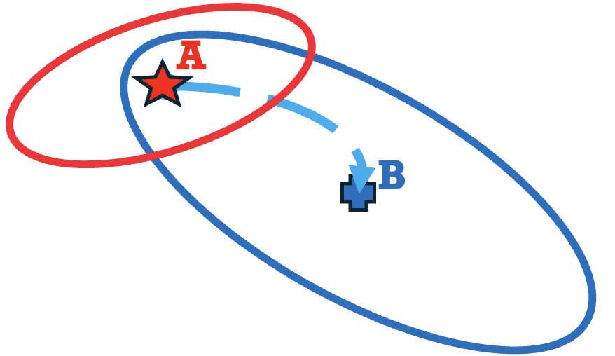
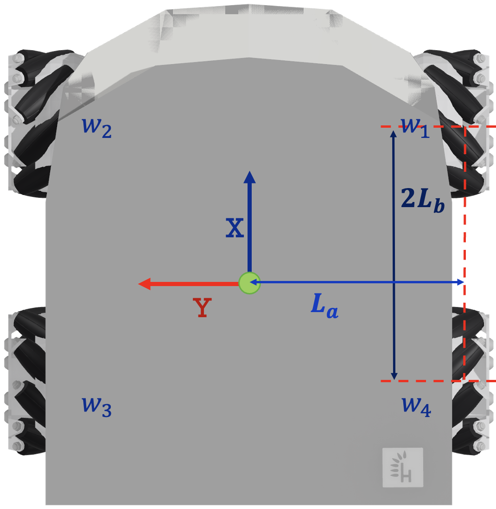
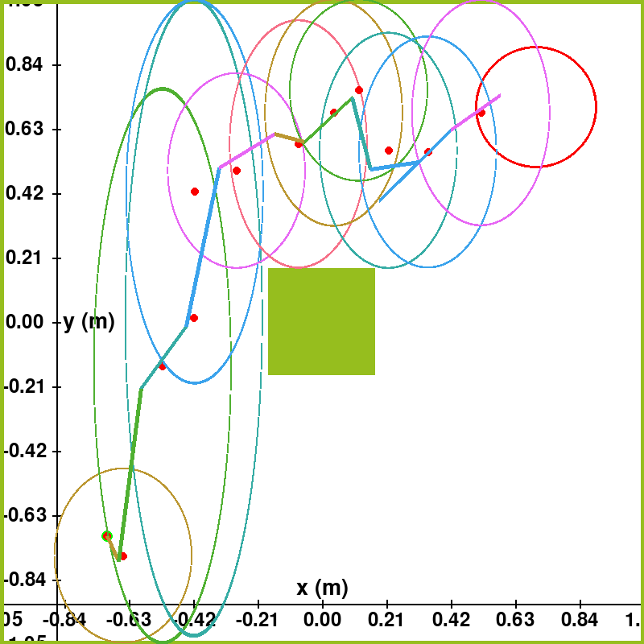
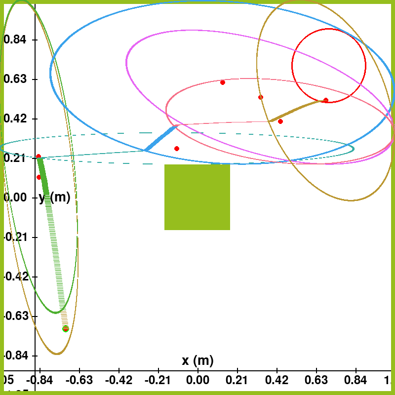

# DASH-RRT
This project presents an adversarial-disturbance-aware motion planning technique that generates collision-free paths using invariant sets. The proposed planner learns a series of invariant sets within which closed-loop trajectories adhere to safety and disturbance attenuation criteria. Each learned performance-aware invariant set is centered around randomly generated waypoints, which form a corridor of connected invariant sets. A data-based optimization problem identifies the largest invariant region for each waypoint and designs a robust controller to ensure safety. The algorithm, named Dynamics-aware Safe $H_\infty$ Motion Planning (DAS$H_\infty$), integrates the notion of the worst-case adversarial disturbance rejection between waypoints, minimizing the need for frequent re-planning in disturbed environments. The effectiveness of this approach is validated through simulations and real-world trials involving an omnidirectional wheeled robot navigation task with obstacle avoidance.

<center>
  <table>
    <tr>
      <td align="center">
        
        <br>
        <em>Graph Rule.</em>
      </td>
      <td align="center">
        
        <br>
        <em>Husarion ROSbot XL from above with its coordinate
frame and labeling.</em>
      </td>
    </tr>
  </table>
</center>

### Cloning the Project

First, clone the repository to your local machine:

```bash
git clone https://github.com/NarimanNiknejad/DASH-RRT.git
cd DASH-RRT
```

### Conda Environment

Before proceeding, ensure that you have Conda installed. If not, you can download and install it from [here](https://docs.conda.io/en/latest/miniconda.html).

To set up the Conda environment for this project, run the following commands:

```bash
conda env create -f SODA.yml
conda activate SODA
```

### 1. Download MOSEK

1. Visit the MOSEK download page: [MOSEK Download](https://www.mosek.com/downloads/).

2. Select the appropriate version of MOSEK for your operating system. MOSEK provides versions for Windows, Linux, and macOS.

3. Download the MOSEK installation package.

### 2. Install MOSEK

Follow the installation instructions provided by MOSEK to install the software on your system.

### 3. Obtain a License

1. MOSEK requires a license to use. You can request a free academic license, a trial license, or purchase a commercial license.

2. To request an academic license or a trial license, visit the MOSEK License Request page.

3. Follow the steps on the license request page to obtain your license file. This file will be used to activate MOSEK on your machine.

4. If you decide to purchase a commercial license, contact MOSEK directly through their website for more information on pricing and licensing options.

5. ## Usage

To run the simulation and visualize the results, execute the main script:

```bash
python planning_code.py
```


## Citation
If you found this page useful for your research, please cite it as:

(submitted and waiting for the citation information)

## License

This project is licensed under the [MIT License] - see the [LICENSE.md](LICENSE) file for details.

## Results


<center>
  <table>
    <tr>
      <td align="center">
        
        <br>
        <em>DASH-RRT Algorithm; simulation.</em>
      </td>
      <td align="center">
        
        <br>
        <em>DASH-RRT Algorithm; real-world.</em>
      </td>
    </tr>
  </table>
</center>

